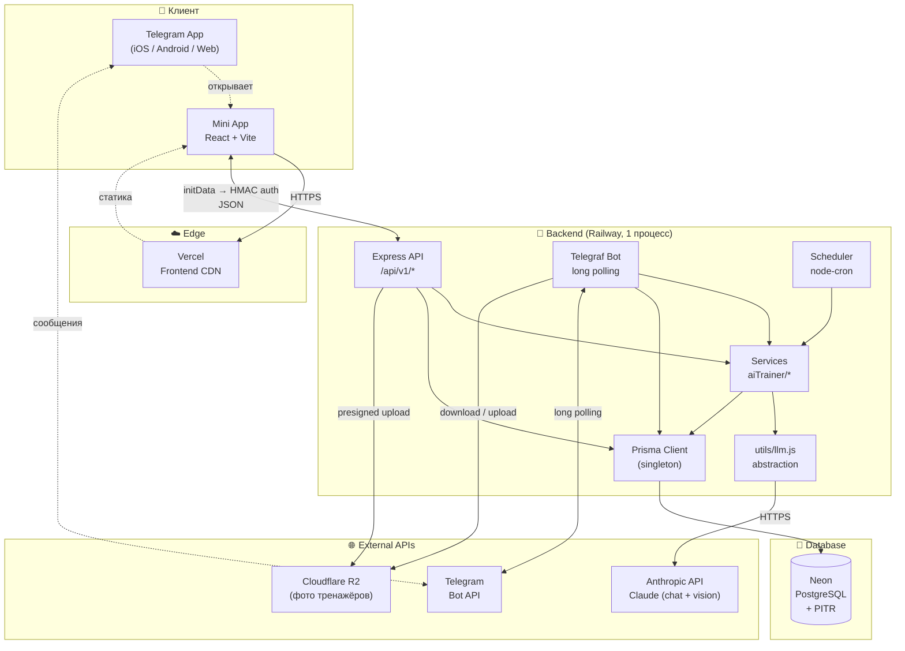
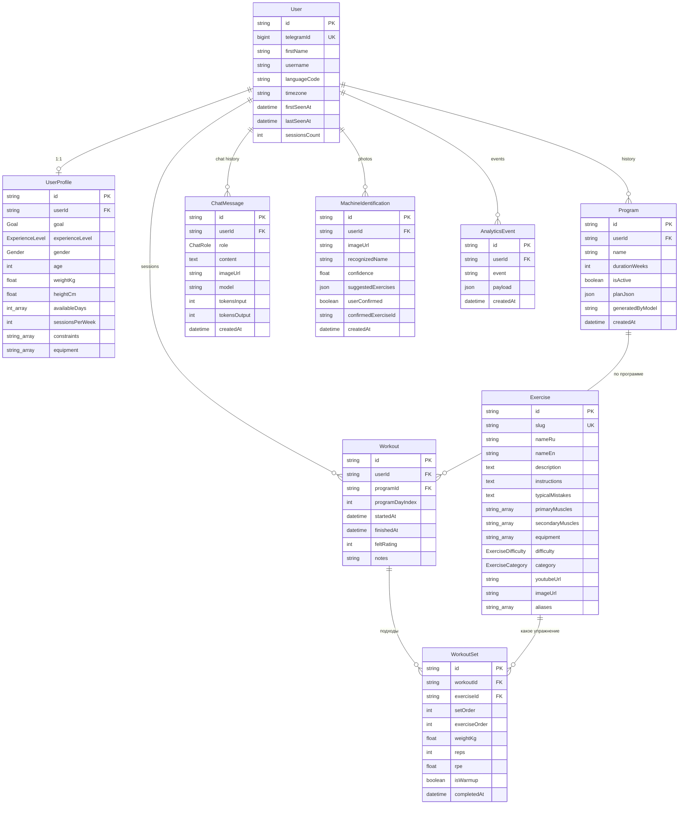

# ARCHITECTURE — AI Trainer

Все технические и архитектурные решения. Продуктовая часть — в [BRD.md](BRD.md). Приоритеты разработки и бэклог — в [NEXT_PLANS.md](NEXT_PLANS.md).

**Последнее обновление:** 2026-04-20

---

## 1. Технологический стек

Стек наследует проверенные в проде решения из пет-проекта автора [daily balancer / Life Progress Tracker](../daily%20balancer/life-progress-tracker/). Переиспользуем всё, что сработало; добавляем AI-специфичное поверх.

### Клиент (Mini App)
- **React 19** + **Vite 7**
- **Tailwind CSS 4** как Vite-плагин (не PostCSS; ~50% быстрее билд)
- **React Router 7** — SPA
- **Lucide React** — outline-иконки
- **Recharts** — графики прогресса (тоннаж, 1RM, частота)
- **Telegram WebApp SDK** — нативная интеграция

### Сервер (API + бот в одном процессе)
- **Node.js + Express 5**
- **Telegraf** — Telegram-бот (long polling)
- **Prisma 6** + **PostgreSQL**
- **Zod** — валидация входов API
- **node-cron** — отложенные уведомления и напоминания
- **LLM-клиент**: `@anthropic-ai/sdk` для Claude, за тонкой абстракцией `utils/llm.js`

### Инфраструктура
- **Frontend:** Vercel (автодеплой из GitHub, `vercel.json` c SPA-rewrites)
- **Backend + бот:** Railway (автодеплой из `/server`)
- **БД:** Neon PostgreSQL с включённой Point-in-Time Recovery (PITR)
- **Object Storage:** Cloudflare R2 (фото тренажёров; S3-совместимое, без egress)

### Язык

JavaScript в MVP (как в daily balancer). Перейти на TypeScript — рассмотрим, когда появится заметная AI-логика с JSON-схемами (возможно, только для `server/src/services/aiTrainer/`). Решение пока открыто; см. [NEXT_PLANS.md](NEXT_PLANS.md).

---

## 2. Архитектура сервиса

### 2.1 Высокоуровневая схема



### 2.2 Ключевые потоки данных

**(A) Логирование подхода (mini app)**

```
Пользователь тапает "Сохранить подход" в мини-аппе
  → POST /api/v1/workouts/:id/sets { exerciseId, weightKg, reps, rpe? }
  → telegramAuth middleware → req.user
  → Zod-валидация тела
  → Prisma: INSERT WorkoutSet
  → track('set_logged', ...) — без await
  → 200 { set }
  → UI: optimistic update + хаптик success
```

**(B) AI-чат между подходами**

```
Юзер пишет боту "чем заменить жим?"
  → Telegraf on('text') handler
  → services/aiTrainer/chatWithContext.js
      - фетчит последние N ChatMessage + последние 3 Workout юзера
      - собирает system prompt + контекст
      - llm.chat(messages, { tools })
  → сохраняет ChatMessage (user + assistant)
  → track('ai_chat_message', ...)
  → bot.sendMessage(ответ)
```

**(C) Распознавание тренажёра по фото**

```
Юзер шлёт фото в бот
  → Telegraf on('photo') handler
  → скачивает файл из Telegram, загружает в R2 (presigned)
  → services/aiTrainer/identifyMachine.js
      - llm.vision(imageBase64, prompt) → structured JSON
      - { machineName, confidence, suggestedExercises[] }
  → сохраняет MachineIdentification (imageUrl, результат, confidence)
  → track('exercise_identified' | 'exercise_identification_failed')
  → bot.sendMessage(результат + inline-кнопки "начать" / "альтернативы")
```

**(D) Генерация программы после онбординга**

```
Юзер завершает онбординг
  → POST /api/v1/programs/generate
  → fetch UserProfile
  → services/aiTrainer/generateProgram.js
      - llm.chat(systemPrompt + profile) → structured JSON weeks[].days[].exercises[]
      - валидация структуры (Zod)
  → Prisma transaction:
      - UPDATE Program SET isActive=false WHERE userId=...
      - INSERT Program { planJson, isActive=true, generatedByModel }
  → track('program_generated', ...)
  → 200 { program }
```

**(E) Еженедельная сводка (шедулер)**

```
node-cron '0 10 * * 1' (понедельник 10:00 UTC — упрощённо на старте)
  → для каждого активного юзера:
      - fetch Workouts за последнюю неделю + ключевые метрики (тоннаж, прогресс в базе)
      - services/aiTrainer/analyzeProgress.js → текст сводки
      - bot.sendMessage(сводка + кнопка "Открыть мини-апп")
  → track('weekly_summary_sent', ...)
```

### 2.3 Принципы архитектуры

- **Монолит в одном процессе.** Бот и API живут в одном Node-процессе. Разделяем только когда реально заболит (пока не болит).
- **Контроллеры тонкие, сервисы толстые.** Всё, что касается LLM и сложной бизнес-логики, — в `services/aiTrainer/`, чтобы не размазывать промпты по контроллерам.
- **LLM только через `utils/llm.js`.** Единая точка для retry, timeout, логирования, смены провайдера.
- **База — источник истины.** Кэш добавляем, только когда есть измеримая проблема.
- **Fire-and-forget на аналитике.** Никогда не блокируем пользовательский ответ ради метрики.
- **Оптимистичный UI.** Мини-апп показывает результат мгновенно, сервер — асинхронно. Для логирования в зале это критично.

---

## 3. Структура репозитория

Плоская структура (не монорепо) — как в daily balancer. Меньше конфигурации, проще навигация.

```
/ai-trainer
├── CLAUDE.md          # квикстарт + правила
├── BRD.md             # продукт
├── ARCHITECTURE.md    # этот файл
├── NEXT_PLANS.md      # бэклог
├── UPDATES.md         # changelog
│
├── index.html         # mini-app entry
├── vite.config.js
├── vercel.json        # SPA rewrites: /(.*) → /index.html
├── package.json
├── .env               # VITE_API_URL=...
│
├── src/               # React mini-app
│   ├── main.jsx
│   ├── App.jsx
│   ├── pages/
│   │   ├── Main/      # WorkoutPage, ExerciseLibrary, ProgressPage, ChatPage
│   │   └── Editors/   # ExerciseEditor, ProgramEditor
│   ├── components/    # UI, layout, TelegramProvider
│   ├── hooks/
│   ├── i18n/          # TranslationProvider, useTranslation, translations.js
│   └── utils/
│
└── server/            # Express + Telegraf + Prisma
    ├── package.json
    ├── .env           # DATABASE_URL, BOT_TOKEN, ANTHROPIC_API_KEY, ...
    ├── prisma/
    │   └── schema.prisma
    └── src/
        ├── index.js                   # entry: Express + bot.launch() + scheduler
        ├── controllers/               # бизнес-логика per entity
        ├── routes/                    # все под /api/v1/
        ├── middleware/
        │   ├── telegramAuth.js        # HMAC-SHA256 валидация initData
        │   └── errorHandler.js
        ├── bot/
        │   ├── index.js               # createBot() → Telegraf
        │   ├── handlers/              # команды
        │   └── commands.txt           # для setMyCommands в BotFather
        ├── services/                  # сложная логика
        │   └── aiTrainer/             # генерация программ, промпты
        ├── scheduler/                 # node-cron: напоминания
        └── utils/
            ├── prisma.js              # singleton Prisma client
            ├── llm.js                 # abstraction: chat() / vision()
            ├── analytics.js           # fire-and-forget track()
            └── dateUtils.js
```

---

## 4. Схема БД

### 4.1 ER-диаграмма



### 4.2 Prisma-схема (черновик v1)

Для MVP. Итеративно дополняем по мере работы. Файл: `server/prisma/schema.prisma`.

```prisma
generator client {
  provider = "prisma-client-js"
}

datasource db {
  provider = "postgresql"
  url      = env("DATABASE_URL")
}

// ═══════════════════════════════════════════════
// User — создаётся через telegramAuth middleware
// ═══════════════════════════════════════════════
model User {
  id             String    @id @default(uuid())
  telegramId     BigInt    @unique
  firstName      String
  lastName       String?
  username       String?
  languageCode   String?
  photoUrl       String?
  timezone       String?

  firstSeenAt    DateTime  @default(now())
  lastSeenAt     DateTime  @default(now())
  sessionsCount  Int       @default(0)

  createdAt      DateTime  @default(now())
  updatedAt      DateTime  @updatedAt

  profile                UserProfile?
  programs               Program[]
  workouts               Workout[]
  chatMessages           ChatMessage[]
  machineIdentifications MachineIdentification[]
  analyticsEvents        AnalyticsEvent[]
}

// ═══════════════════════════════════════════════
// UserProfile — анкета из онбординга
// ═══════════════════════════════════════════════
model UserProfile {
  id              String           @id @default(uuid())
  userId          String           @unique
  user            User             @relation(fields: [userId], references: [id], onDelete: Cascade)

  goal            Goal
  experienceLevel ExperienceLevel
  gender          Gender?
  age             Int?
  weightKg        Float?
  heightCm        Float?

  availableDays   Int[]            @default([])      // 0=ВС..6=СБ
  sessionsPerWeek Int?

  constraints     String[]         @default([])      // ['lower_back', 'knee', ...]
  equipment       String[]         @default([])      // ['barbell', 'machine', ...]

  createdAt       DateTime         @default(now())
  updatedAt       DateTime         @updatedAt
}

enum Goal {
  weight_loss
  muscle_gain
  strength
  tone
  endurance
  general_fitness
}

enum ExperienceLevel {
  beginner
  intermediate
  advanced
}

enum Gender {
  male
  female
  other
}

// ═══════════════════════════════════════════════
// Exercise — глобальная библиотека упражнений
// Заполняется через server/scripts/seedExercises.js
// ═══════════════════════════════════════════════
model Exercise {
  id               String              @id @default(uuid())
  slug             String              @unique           // 'barbell-bench-press'

  nameRu           String
  nameEn           String?

  description      String?             @db.Text
  instructions     String?             @db.Text
  typicalMistakes  String?             @db.Text

  primaryMuscles   String[]            @default([])     // ['chest', 'triceps', ...]
  secondaryMuscles String[]            @default([])
  equipment        String[]            @default([])     // ['barbell', 'bench', ...]

  difficulty       ExerciseDifficulty  @default(beginner)
  category         ExerciseCategory    @default(compound)

  youtubeUrl       String?
  imageUrl         String?

  aliases          String[]            @default([])     // синонимы для распознавания

  createdAt        DateTime            @default(now())
  updatedAt        DateTime            @updatedAt

  workoutSets      WorkoutSet[]

  @@index([category])
}

enum ExerciseDifficulty {
  beginner
  intermediate
  advanced
}

enum ExerciseCategory {
  compound
  isolation
  cardio
  warmup
  stretch
  mobility
}

// ═══════════════════════════════════════════════
// Program — сгенерированная программа тренировок
// План хранится как JSON (проще, чем отдельные таблицы ProgramDay/ProgramExercise)
// Структура planJson: { weeks: [{ days: [{ title, exercises: [{ exerciseId, sets, reps, restSec, notes }] }] }] }
// ═══════════════════════════════════════════════
model Program {
  id               String    @id @default(uuid())
  userId           String
  user             User      @relation(fields: [userId], references: [id], onDelete: Cascade)

  name             String
  description      String?
  durationWeeks    Int       @default(4)
  isActive         Boolean   @default(false)            // одна активная на юзера
  planJson         Json

  generatedByModel String?                              // 'claude-*' — для аналитики качества

  createdAt        DateTime  @default(now())
  updatedAt        DateTime  @updatedAt

  workouts         Workout[]

  @@index([userId, isActive])
}

// ═══════════════════════════════════════════════
// Workout — реальная тренировка (сессия в зале)
// ═══════════════════════════════════════════════
model Workout {
  id              String       @id @default(uuid())
  userId          String
  user            User         @relation(fields: [userId], references: [id], onDelete: Cascade)

  programId       String?
  program         Program?     @relation(fields: [programId], references: [id], onDelete: SetNull)
  programDayIndex Int?                                  // индекс дня из planJson, если применимо

  startedAt       DateTime     @default(now())
  finishedAt     DateTime?

  feltRating      Int?                                  // 1..5 — как прошла тренировка
  notes           String?

  sets            WorkoutSet[]

  @@index([userId, startedAt])
}

// ═══════════════════════════════════════════════
// WorkoutSet — один подход в упражнении
// ═══════════════════════════════════════════════
model WorkoutSet {
  id             String    @id @default(uuid())
  workoutId      String
  workout        Workout   @relation(fields: [workoutId], references: [id], onDelete: Cascade)

  exerciseId     String
  exercise       Exercise  @relation(fields: [exerciseId], references: [id])

  exerciseOrder  Int       @default(0)                  // порядок упражнения в тренировке
  setOrder       Int       @default(0)                  // порядок подхода в упражнении

  weightKg       Float?
  reps           Int
  rpe            Float?                                 // Rate of Perceived Exertion 1..10
  isWarmup       Boolean   @default(false)
  notes          String?

  completedAt    DateTime  @default(now())

  @@index([workoutId])
  @@index([exerciseId])
}

// ═══════════════════════════════════════════════
// ChatMessage — история диалога с AI-тренером
// ═══════════════════════════════════════════════
model ChatMessage {
  id             String    @id @default(uuid())
  userId         String
  user           User      @relation(fields: [userId], references: [id], onDelete: Cascade)

  role           ChatRole
  content        String    @db.Text
  imageUrl       String?                                // если было сообщение с фото

  model          String?                                // какой LLM ответил
  tokensInput    Int?
  tokensOutput   Int?

  createdAt      DateTime  @default(now())

  @@index([userId, createdAt])
}

enum ChatRole {
  user
  assistant
  system
}

// ═══════════════════════════════════════════════
// MachineIdentification — лог распознаваний по фото
// Нужен для: аналитики, последующего улучшения промпта, возможного датасета
// ═══════════════════════════════════════════════
model MachineIdentification {
  id                  String    @id @default(uuid())
  userId              String
  user                User      @relation(fields: [userId], references: [id], onDelete: Cascade)

  imageUrl            String                              // R2 URL
  recognizedName      String?
  confidence          Float?                              // 0..1

  suggestedExercises  Json      @default("[]")            // [{ exerciseId, name, reasoning }]

  userConfirmed       Boolean?                            // выбрал ли юзер упражнение
  confirmedExerciseId String?

  model               String?

  createdAt           DateTime  @default(now())

  @@index([userId, createdAt])
}

// ═══════════════════════════════════════════════
// AnalyticsEvent — fire-and-forget события
// ═══════════════════════════════════════════════
model AnalyticsEvent {
  id         String    @id @default(uuid())
  userId     String?
  user       User?     @relation(fields: [userId], references: [id], onDelete: SetNull)

  event      String                                       // 'workout_logged', 'exercise_photo_taken', ...
  payload    Json?

  createdAt  DateTime  @default(now())

  @@index([event, createdAt])
  @@index([userId, createdAt])
}
```

### 4.3 Решения и trade-offs

- **Program хранится как JSON**, не реляционно (`ProgramDay`, `ProgramExercise`). Причины: (1) LLM генерирует структурированный JSON — проще сохранить как есть; (2) редактируется целиком, не по полю; (3) запросов "все программы с жимом" в MVP нет. Разбить на таблицы — когда понадобится аналитика по упражнениям внутри программ.
- **WorkoutSet ссылается напрямую на Exercise**, а не на `ProgramExercise`. Так проще делать замены упражнений на лету и логировать "внеплановые" подходы.
- **MachineIdentification — отдельная таблица**, не подтип `ChatMessage`. Она критична для метрик ключевой фичи (точность распознавания) и возможного будущего датасета для дообучения.
- **Глобальный `Exercise`, не per-user.** База упражнений одинаковая для всех. Если появится потребность в кастомных упражнениях юзера — добавим `userId: String?` (nullable = глобальное).
- **`isActive` на Program** вместо отдельного `currentProgramId` у юзера. Проще поддерживать историю программ.
- **`telegramId` как BigInt**, а не Int — Telegram ID уже выходит за пределы int32 и продолжает расти.
- **`aliases[]` на Exercise** — массив синонимов ("жим лёжа", "bench press", "жим штанги лёжа") для подбора упражнения после распознавания тренажёра и текстового поиска.
- **Каскадные удаления через `onDelete: Cascade`** на данных юзера — чтобы удаление юзера (GDPR) убирало всё одной транзакцией. `AnalyticsEvent` — `SetNull` (сохраняем агрегатную аналитику).
- **Enum vs string-массив для мышц/оборудования.** Взяли `String[]`, а не enum — даёт гибкость добавлять новые метки без миграции. Для консистентности — валидатор на уровне приложения (Zod-схема "известные мышцы").
- **Нет явной таблицы `Equipment` / `MuscleGroup`.** Хардкодим списки в Zod-схемах и константах. Добавим таблицу, если понадобится i18n или отдельные метаданные.

### 4.4 Индексы (под ключевые запросы)

| Запрос | Индекс |
|--------|--------|
| `SELECT User WHERE telegramId = ?` (каждый запрос через auth) | `@@unique([telegramId])` |
| `SELECT Program WHERE userId=? AND isActive=true` | `@@index([userId, isActive])` |
| `SELECT Workout WHERE userId=? ORDER BY startedAt DESC` | `@@index([userId, startedAt])` |
| `SELECT ChatMessage WHERE userId=? ORDER BY createdAt DESC LIMIT N` | `@@index([userId, createdAt])` |
| `SELECT AnalyticsEvent WHERE event=? AND createdAt > ?` | `@@index([event, createdAt])` |

### 4.5 Миграции

Напоминание: **никаких `prisma migrate`**. Только `prisma db push` + ручной SQL для опасных операций. Детали и правила — в разделе [5.2](#52-работа-с-prisma).

---

## 5. Паттерны, унаследованные из daily balancer

### 5.1 Авторизация

**Middleware `telegramAuth`** на всех защищённых роутах `/api/v1/*`:
1. Читает `Authorization: tma <initData>`.
2. Валидирует initData через HMAC-SHA256 с `BOT_TOKEN`.
3. Upsert `User` по `telegramId`.
4. `req.user` доступен в контроллерах.
5. Side-effect: update `lastSeenAt`, `sessionsCount`, fire analytics `user_seen`.

**Dev-bypass:** в `NODE_ENV=development` заголовок `Authorization: tma dev_bypass` создаёт/использует тестового юзера без Telegram. Удобно для локальной разработки с обычным браузером.

Правило: каждый новый роут-модуль начинается с `router.use(telegramAuth)`, иначе `TypeError: Cannot read properties of undefined (reading 'id')` на `req.user.id`.

### 5.2 Работа с Prisma

- **Миграции не используем.** Только `prisma db push`.
- `server/src/utils/prisma.js` — **singleton** клиент:
  ```js
  import { PrismaClient } from '@prisma/client'
  const prisma = globalThis.__prisma ?? new PrismaClient()
  if (process.env.NODE_ENV !== 'production') globalThis.__prisma = prisma
  export default prisma
  ```
- Zod-схемы для валидации тел запросов в контроллерах.

**⚠️ Правила безопасности `db push`** (выучены кровью в daily balancer — дроп таблиц 2026-03-08):

| Изменение | Как делать |
|-----------|-----------|
| Новая таблица | `db push` безопасно |
| Nullable колонка (`String?`) | `db push` безопасно |
| NOT NULL с `@default(...)` на существующую таблицу | Сначала `ALTER TABLE ... ADD COLUMN ... NOT NULL DEFAULT '...';` в Neon Console, потом `db push` (увидит "already in sync") |
| Rename колонки | Только `ALTER TABLE ... RENAME COLUMN ...` вручную |
| Смена типа / удаление | Ручной SQL |

Перед любым `db push` на проде — зафиксировать timestamp для возможного PITR-отката.

### 5.3 Telegram-бот

- **Бот и API в одном Express-процессе.** `server/src/index.js` запускает Express и `bot.launch()` параллельно при наличии `BOT_TOKEN`.
- **Telegraf** как фреймворк бота.
- **`setMyCommands` со scope** — разные меню команд для личного/группового чата (сейчас только личный).
- Команды в `server/src/bot/commands.txt` — копипаст в BotFather через `/setcommands`.
- Menu Button в BotFather → URL мини-аппа (см. deploy).
- Graceful shutdown через SIGINT / SIGTERM.

### 5.4 API-дизайн

- Все роуты под `/api/v1/`.
- Структура: `routes/` → `controllers/`. Prisma внутри контроллеров, отдельного слоя repositories нет. `services/` появляется только для сложной логики (LLM, vision, генерация программ).
- Health-check: `GET /api/health`.
- Централизованный `errorHandler` middleware в конце цепочки Express.

### 5.5 Аналитика

- Самописная, без SaaS: таблица `AnalyticsEvent` + функция `track(userId, event, payload)` в `utils/analytics.js`.
- Fire-and-forget — вызывается **без `await`**, не блокирует запрос.
- Админ-эндпоинты `/api/v1/analytics/{summary|events|funnel|users}?key=ANALYTICS_SECRET` с защитой секретом из env.

**Ключевые события AI Trainer (стартовый набор):**
- `user_registered`
- `onboarding_completed`
- `program_generated`
- `workout_started`
- `workout_logged`
- `set_logged`
- `exercise_photo_taken`
- `exercise_identified` / `exercise_identification_failed`
- `ai_chat_message`
- `exercise_viewed`

### 5.6 Frontend-паттерны

- **Тёмная тема** с первого дня. Палитра (кандидат, можно тюнить под фитнес-контекст):
  - Фон: `#0F0F13`
  - Карточки: `#1A1A24`
  - Акцент: `#7C5CFC` (или свой зелёный под "энергия/здоровье")
  - Success: `#34D399`
  - Glass pills: `linear-gradient(135deg, rgba(30,30,45,0.75), rgba(20,20,32,0.85))` + `blur(28px)`.
- **Skeletons вместо spinners** — placeholder-элементы, повторяющие layout.
- **Optimistic updates с rollback** — `setState` сразу, API в фоне, откат при ошибке. Критично для логирования подходов в зале (пользователь не ждёт сервер).
- **Haptic feedback** через Telegram WebApp API:
  - `impactOccurred('light')` — обычные действия.
  - `notificationOccurred('success')` — завершение подхода / тренировки.
  - `impactOccurred('medium')` — значимые события (новый рекорд).
- **Splash loader** — чистый HTML/CSS в `index.html` (не React), чтобы показаться мгновенно до гидрации.
- **i18n строго через `t()`**: `const { t } = useTranslation(); t('workout.logSet')`. Никаких хардкод-строк в JSX. В MVP — только `ru`, но слой ставим сразу.

### 5.7 Структура контроллера (шаблон)

```js
// server/src/controllers/workoutController.js
import { z } from 'zod'
import prisma from '../utils/prisma.js'
import { track } from '../utils/analytics.js'

const logSetSchema = z.object({
  exerciseId: z.string().uuid(),
  weight: z.number().nonnegative(),
  reps: z.number().int().positive(),
})

export async function logSet(req, res) {
  const data = logSetSchema.parse(req.body)
  const set = await prisma.workoutSet.create({
    data: { ...data, userId: req.user.id },
  })
  track(req.user.id, 'set_logged', { exerciseId: data.exerciseId })   // без await
  res.json({ set })
}
```

---

## 6. AI-специфичные решения (поверх референса)

### 6.1 LLM-абстракция

`server/src/utils/llm.js` — тонкий слой поверх Anthropic SDK.

```js
// псевдокод
export async function chat(messages, { tools, maxTokens } = {}) { ... }
export async function vision(imageBase64, prompt, { maxTokens } = {}) { ... }
```

Почему:
- Retry + timeout + логирование в одном месте.
- Лёгкая замена провайдера (Claude → GPT → Gemini) без переписывания контроллеров.
- Централизованная обработка rate limits, 429, 5xx.
- Единый формат ошибок наружу.

**Не импортируем `@anthropic-ai/sdk` напрямую в контроллеры.**

### 6.2 Сервисный слой `services/aiTrainer/`

Вся сложная AI-логика — в сервисах, не в контроллерах:

```
server/src/services/aiTrainer/
├── generateProgram.js     # профиль → персональная программа
├── identifyMachine.js     # фото → название тренажёра + упражнения
├── chatWithContext.js     # user message + history → ответ тренера
├── analyzeProgress.js     # метрики за неделю → рекомендации
└── prompts/               # промпты отдельными файлами, версионируются в git
    ├── systemTrainer.md
    ├── generateProgram.md
    └── identifyMachine.md
```

Промпты — в git как обычные `.md`-файлы, импортируются как строки через `fs.readFileSync` или Vite-подобный import.

### 6.3 Фото тренажёра: поток данных

1. Пользователь в боте отправляет фото → Telegraf-хэндлер.
2. Фото скачивается из Telegram, конвертится в base64.
3. Опционально — заливается в R2 (для кэша и возможного дообучения позже).
4. Вызов `llm.vision(imageBase64, prompt)` → structured JSON: `{ machineName, confidence, suggestedExercises[] }`.
5. Результат возвращается в чат с inline-клавиатурой "начать упражнение" / "показать альтернативы" / "открыть в мини-аппе".
6. Событие `exercise_identified` (или `exercise_identification_failed` при низком `confidence`).

### 6.4 Seed упражнений (скрипт)

`server/scripts/seedExercises.js`:
1. Скачивает [Free Exercise DB](https://github.com/yuhonas/free-exercise-db) (MIT).
2. Фильтрует до силовых в зале (~100–150 упражнений).
3. Дополняет недостающие поля через LLM (typical_mistakes, russian_name, youtube_url).
4. Ручная проверка ключевых записей (базовые движения — жим/присед/тяга).
5. Вставка в таблицу `Exercise`.

Запускается как `cd server && node scripts/seedExercises.js` — не на каждом деплое, а по необходимости.

---

## 7. Нефункциональные требования

Требования намеренно мягкие — пет-проект, малая аудитория на старте.

- **Скорость AI-чата:** до 5–8 секунд на типовой вопрос (сценарий "в моменте между подходами").
- **Распознавание тренажёра:** до 10–15 секунд; приемлемая точность на популярных тренажёрах; fallback через уточняющий диалог.
- **Доступность:** best effort, без SLA.
- **Нагрузка:** проектируем на десятки-сотни пользователей, не тысячи.
- **Приватность:** шифрование чувствительных полей в БД, не логируем персональные данные в plaintext. Полноценный compliance — на коммерческом этапе.

---

## 8. Деплой

### Архитектура

```
┌─────────────────┐     ┌──────────────────┐     ┌──────────────┐
│  Vercel          │     │  Railway          │     │  Neon         │
│  (Frontend)      │────▶│  (Backend + Bot)  │────▶│  PostgreSQL   │
│  React + Vite    │     │  Express+Telegraf │     │  (PITR)       │
└─────────────────┘     └──────────────────┘     └──────────────┘
                                 │
                                 ▼
                        ┌──────────────────┐
                        │  Cloudflare R2    │
                        │  (фото тренажёров)│
                        └──────────────────┘
                                 │
                                 ▼
                        ┌──────────────────┐
                        │  Anthropic API    │
                        │  (Claude)         │
                        └──────────────────┘
```

### Frontend (Vercel)

- Автодеплой на `git push origin main`.
- `vercel.json` c SPA-rewrites: `"rewrites": [{ "source": "/(.*)", "destination": "/index.html" }]`.
- Переменные окружения в Vercel Dashboard:
  ```
  VITE_API_URL=https://<railway-url>
  ```

### Backend (Railway)

- Автодеплой на `git push origin main`, root directory = `/server`.
- Переменные окружения:
  ```
  DATABASE_URL=postgresql://...        # Neon URL
  BOT_TOKEN=<from @BotFather>
  ANTHROPIC_API_KEY=<anthropic>
  R2_ACCESS_KEY=...
  R2_SECRET_KEY=...
  R2_BUCKET=ai-trainer-photos
  R2_ENDPOINT=https://<account>.r2.cloudflarestorage.com
  NODE_ENV=production
  PORT=8080
  FRONTEND_URL=https://<vercel-url>
  WEBAPP_URL=https://<vercel-url>
  ANALYTICS_SECRET=<random>
  ADMIN_TELEGRAM_ID=<my id>
  ```

### БД (Neon)

- **Включить PITR** (Point-in-Time Recovery) — ключевая защита от инцидентов `db push`.
- Схему синхронизировать через `cd server && npx prisma db push` (см. правила в разделе 5.2).
- Визуальный браузер данных: `npx prisma studio`.

### Telegram-бот (BotFather)

1. `/newbot` → получить `BOT_TOKEN`, положить в Railway env.
2. `/setcommands` → вставить содержимое `server/src/bot/commands.txt`.
3. `/setmenubutton` → ввести URL Vercel + текст "Открыть".

### Локальная разработка

```bash
# Терминал 1: frontend
npm install
npm run dev                  # http://localhost:5173

# Терминал 2: backend
cd server
npm install
npm run dev                  # http://localhost:3001
```

Frontend `.env`:
```
VITE_API_URL=http://localhost:3001
```

Backend `server/.env`: как на проде + может использовать отдельную dev-БД.

Без Telegram — dev-bypass в API, см. 5.1.

### Цикл деплоя

```bash
# 1. Проверить билд
npm run build

# 2. Если менялась схема БД — безопасно синхронизировать
cd server && npx prisma db push

# 3. Коммит + push
git add -A
git commit -m "feat: ..."
git push origin main

# 4. Vercel + Railway подхватят автоматически

# 5. Проверить
curl https://<railway-url>/api/health
```

### Восстановление (Neon PITR)

При потере данных:
1. Neon Console → Branches → Restore с нужным timestamp.
2. После восстановления — проверить таблицы.
3. Применить изменения схемы через ручной SQL (не `db push`).

---

## 9. Технические решения (Decision Log)

Продуктовые решения — в [BRD.md](BRD.md#11-продуктовые-решения-decision-log).

| # | Вопрос | Решение | Обоснование |
|---|--------|---------|-------------|
| 1 | LLM / Vision API | Claude (Anthropic) | Сильный vision, структурированный вывод, следование инструкциям. За абстракцией для замены |
| 2 | Хостинг | Vercel + Railway + Neon + R2 | Проверено в проде в daily balancer. `git push` → автодеплой. Neon PITR спасает от `db push` |
| 3 | Бот-фреймворк | Telegraf | Переиспользуем из daily balancer, есть наработки |
| 4 | API-фреймворк | Express 5 | Из daily balancer |
| 5 | ORM | Prisma 6 без миграций, `db push` + ручной SQL | Паттерн из daily balancer |
| 6 | Структура репо | Плоская (frontend в корне, `/server`) | Из daily balancer, минимум конфигурации |
| 7 | Язык | JavaScript на старте; TypeScript рассматривается для AI-сервисов | Соло-разработка, как в референсе. TS — если заметно упрощает работу с JSON-схемами |
| 8 | База упражнений | Free Exercise DB (MIT) + LLM для пробелов | Быстрый старт, качество под контролем |
| 9 | Видео | Ссылки на YouTube | Бесплатно, большой выбор |
| 10 | Аналитика | Самописная `AnalyticsEvent` + fire-and-forget `track()` | Ноль внешних зависимостей, паттерн из daily balancer |

---

## 10. Технические риски

- **`prisma db push` ломает прод.** *Митигация:* правила из 3.2, PITR в Neon, dev-проверка на отдельной БД.
- **Стоимость LLM/Vision при раздаче друзьям.** *Митигация:* лимиты на запросы, кэширование ответов для повторяющихся фото/вопросов, выбор экономичной модели для vision.
- **Rate limits Anthropic API.** *Митигация:* retry с backoff в `utils/llm.js`, graceful degradation (пишем юзеру "сейчас много запросов, попробуй через минуту").
- **Vision не распознаёт редкие тренажёры.** *Митигация:* fallback-диалог ("не уверен, помоги уточнить"), логирование неудачных кейсов для дальнейшего улучшения промпта.
- **Overengineering для соло-разработки.** *Митигация:* правило "не добавлять зависимость/инструмент, пока он реально не нужен".
