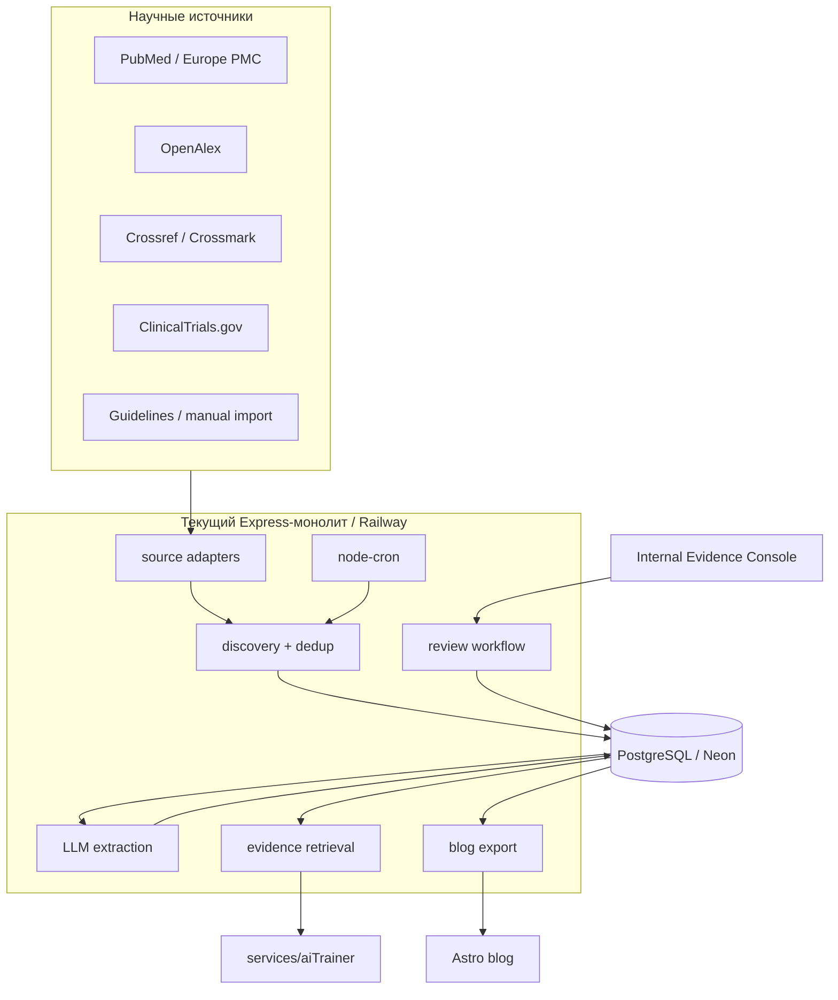

# EVIDENCE KNOWLEDGE BASE — научная база знаний AI Trainer

Продуктовая и техническая архитектура системы, которая превращает исследования о
силовых тренировках в проверенные знания для AI-тренера и блога.

**Статус:** концепция / source of truth до начала реализации
**Создан:** 2026-08-02
**Связанные документы:** [AI_TRAINER_PLAN.md](AI_TRAINER_PLAN.md),
[ARCHITECTURE.md](ARCHITECTURE.md), [BRD.md](BRD.md)

---

## 1. Коротко о решении

Мы строим не архив PDF и не RAG по сырым статьям, а **версионируемую базу
утверждений** (`EvidenceClaim`).

```text
исследования → оценка → синтез → утверждение → продуктовая рекомендация
                                             ├─ AI-тренер
                                             └─ блог / SEO
```

Исследование — источник данных. `EvidenceClaim` — наш вывод по совокупности данных.
`EvidenceRecommendation` — разрешённый способ применить этот вывод в продукте.

Главный инвариант:

> Новая публикация никогда не меняет поведение AI-тренера и публичный контент
> напрямую. Сначала она проходит отбор и оценку, затем создаётся новая версия claim,
> которая должна быть явно утверждена человеком.

Для первой версии отдельные сервисы, vector database и сложный data pipeline не
нужны. Система реализуется внутри текущего Express-монолита на PostgreSQL/Neon,
Prisma, `node-cron` и существующей LLM-абстракции. Astro-блог остаётся статическим.

---

# Часть I. Продуктовая архитектура

## 2. Проблема

Сейчас знания AI-тренера находятся преимущественно в системных промптах и общих
знаниях LLM. Это создаёт несколько рисков:

- невозможно установить, на чём основана конкретная рекомендация;
- отдельное яркое исследование может быть переоценено;
- модель может смешать данные для разных популяций;
- устаревший или отозванный источник продолжит влиять на ответы;
- блог и тренер могут давать разные ответы на один вопрос;
- обновление знаний требует ручного редактирования множества промптов и статей.

Нужен единый evidence layer, который отделяет научные данные от их интерпретации и
продуктового применения.

## 3. Цели и границы

### 3.1 Цели

1. Дать AI-тренеру короткие, проверенные и применимые рекомендации с понятной
   степенью уверенности.
2. Создать единый источник истины для AI, продуктовых текстов и блога.
3. Регулярно находить новые исследования и отслеживать corrections/retractions.
4. Сохранять происхождение каждого вывода и историю его изменений.
5. Ускорить выпуск качественного контента без автоматической публикации
   непроверенных медицинских или фитнес-советов.
6. Постепенно сформировать собственный трудно копируемый knowledge asset:
   `источник → оценка → вывод → применимость → рекомендация → использование`.

### 3.2 Не цели первой версии

- проведение собственных систематических обзоров и метаанализов;
- исчерпывающий индекс всей спортивной науки;
- автоматическая медицинская диагностика;
- рекомендации по лечению травм, заболеваний или боли;
- работа с фармакологией и допингом;
- автоматическая публикация SEO-страниц;
- пользовательский аналог PubMed;
- замена научного или медицинского редактора.

### 3.3 Первая целевая популяция

Здоровые взрослые, самостоятельно занимающиеся силовыми тренировками в зале.

На старте не переносим рекомендации автоматически на:

- несовершеннолетних;
- беременных;
- пожилых с медицинскими ограничениями;
- людей в реабилитации;
- пользователей с острой или необъяснимой болью;
- людей с диагностированными заболеваниями, влияющими на тренировочный процесс.

Для таких ситуаций AI сохраняет существующий safety boundary: не интерпретирует
evidence как лечение и рекомендует обратиться к подходящему специалисту.

## 4. Пользователи системы

| Роль | Задача | Интерфейс |
|---|---|---|
| Пользователь AI Trainer | Получить применимый и честный совет | Telegram-чат, программа, инсайты |
| Куратор | Разобрать очередь новых работ | Internal Evidence Console |
| Reviewer | Проверить оценку и утвердить claim | Internal Evidence Console |
| Редактор блога | Создать материал из утверждённых claims | Evidence Console + Markdown/Astro |
| Система | Найти, дедуплицировать и повторно проверить работы | Scheduler + ingestion pipeline |

В MVP куратор, reviewer и редактор могут быть одним человеком. Роли всё равно
фиксируются раздельно в данных и audit log.

## 5. Карта знаний

База организуется от пользовательского вопроса, а не от журнала или автора.

```text
Домен
└─ Тема
   └─ EvidenceQuestion
      ├─ EvidenceClaim v1 → superseded
      ├─ EvidenceClaim v2 → approved
      ├─ ResearchWork[]
      └─ EvidenceRecommendation[]
```

Пример:

```text
Гипертрофия
└─ Интенсивность усилия
   └─ Нужно ли тренироваться до отказа?
      ├─ Claim: постоянный отказ не обязателен для гипертрофии
      ├─ Population: healthy adults, trained/untrained
      ├─ Certainty: moderate
      ├─ Ограничения: мало данных по долгосрочным результатам у advanced
      └─ Recommendation: большинство подходов выполнять с 1–3 RIR
```

### 5.1 Стартовые домены

1. Тренировочный объём.
2. Частота тренировки мышечной группы.
3. Диапазоны повторений и нагрузка.
4. Близость к отказу / RIR / RPE.
5. Отдых между подходами.
6. Прогрессия нагрузки.
7. Выбор и порядок упражнений.
8. Амплитуда и темп.
9. Периодизация и deload.
10. Сочетание силовых тренировок и кардио.
11. Разминка.
12. Восстановление, сон и базовое питание.

Питание в MVP ограничивается общими рекомендациями для здоровых взрослых. Добавки,
дефициты, заболевания и лечебные диеты не входят в автоматические рекомендации.

## 6. Основные продуктовые объекты

### 6.1 `EvidenceQuestion`

Конкретный вопрос, на который должна отвечать база.

Обязательные свойства:

- формулировка вопроса;
- домен и тема;
- целевые population, intervention, comparator, outcomes;
- приоритет для AI и SEO;
- поисковые стратегии по источникам;
- владелец и график пересмотра;
- статус покрытия: `empty`, `collecting`, `covered`, `needs_update`.

### 6.2 `ResearchWork`

Каноническая карточка публикации или guideline, дедуплицированная по DOI, PMID,
registry ID и нормализованным библиографическим данным.

Она хранит метаданные, доступность, права, тип дизайна, correction/retraction status
и ссылку на источник. Закрытый полный текст не копируется в базу без подходящей
лицензии.

### 6.3 `ResearchAssessment`

Оценка работы применительно к конкретному `EvidenceQuestion`. Одна публикация может
иметь разные оценки применимости для разных вопросов.

Оценка включает:

- PICO/PECO;
- дизайн и длительность;
- размер и характеристики выборки;
- основные численные результаты;
- risk of bias;
- прямоту применимости;
- статистическую и практическую значимость;
- funding/conflicts of interest;
- ограничения;
- reviewer и дату проверки.

### 6.4 `EvidenceClaim` и `EvidenceClaimVersion`

`EvidenceClaim` — стабильная смысловая сущность. Каждое изменение текста,
уверенности, применимости или ограничений создаёт неизменяемую версию.

Версия содержит:

- одно атомарное утверждение;
- population и контекст применения;
- outcome и направление эффекта;
- размер эффекта, когда его корректно указывать;
- certainty: `high`, `moderate`, `low`, `very_low`;
- краткое объяснение certainty;
- ограничения и неизвестные;
- поддерживающие, противоречащие и контекстные источники;
- дату следующего пересмотра;
- reviewer decision.

### 6.5 `EvidenceRecommendation`

Продуктовое применение утверждённой версии claim. Утверждение и рекомендация не
объединяются: одинаковые данные могут приводить к разным формулировкам для новичка,
опытного атлета и статьи блога.

Рекомендация задаёт:

- поверхность: `ai_trainer`, `program_generation`, `blog`, `all`;
- аудиторию и предусловия;
- допустимую формулировку;
- практическое действие;
- исключения и safety constraints;
- силу рекомендации: `strong`, `conditional`, `insufficient`;
- связанную версию claim;
- статус и срок пересмотра.

### 6.6 `KnowledgeUsage`

Аудит того, где используется версия знания:

- версия prompt/guideline;
- ответ AI или тип AI-инструмента;
- генератор программы;
- slug статьи;
- продуктовый экран;
- дата начала и завершения использования.

Это позволяет при отзыве источника найти все зависимые материалы.

## 7. Evidence policy

### 7.1 Иерархия источников

Тип исследования — начальный сигнал, а не автоматический рейтинг качества.

Ориентир для приоритизации:

1. качественные актуальные guidelines / consensus statements;
2. качественные systematic reviews и meta-analyses;
3. контролируемые интервенционные исследования;
4. наблюдательные исследования;
5. механистические и острые исследования;
6. экспертное мнение.

Плохой метаанализ не получает преимущество перед хорошо проведённым первичным
исследованием только из-за своего типа.

### 7.2 Certainty и recommendation strength

Certainty описывает уверенность в научном выводе. Recommendation strength описывает,
насколько решительно продукт может советовать действие. Это разные оси.

Например, умеренная уверенность в небольшом различии между двумя безопасными
подходами может дать лишь условную рекомендацию: выбрать тот, который пользователь
лучше соблюдает.

### 7.3 Что не считается доказательством само по себе

- количество цитирований;
- impact factor журнала;
- свежесть публикации;
- известность автора;
- статистическая значимость без размера эффекта;
- вывод abstract без проверки методов и результатов;
- summary, созданный LLM;
- мнение блогера, даже если оно совпадает с claim.

### 7.4 Методические ориентиры

- логика GRADE — для certainty совокупности доказательств;
- AMSTAR 2 — для критической оценки systematic reviews;
- RoB 2 / ROBINS-I — по мере необходимости для первичных исследований;
- PRISMA — сигнал прозрачности отчётности обзора, но не сертификат истинности;
- CONSORT — сигнал полноты отчётности RCT.

В MVP используется адаптированный checklist, а не претензия на формальную полную
GRADE-оценку.

## 8. Lifecycle знания

### 8.1 Поток публикации

```text
discovered
  → duplicate | screened_out | screened_in
  → extracted
  → assessed
  → linked_to_claim
  → reviewed
```

LLM может предложить screening, extraction и draft assessment. Финальные assessment,
claim и recommendation требуют человеческого подтверждения.

### 8.2 Поток claim

```text
draft → in_review → approved → superseded
                  ↘ rejected
approved → disputed → approved | superseded | withdrawn
```

- `approved` — разрешён для retrieval и публикации;
- `disputed` — временно исключён из автоматических рекомендаций;
- `superseded` — сохранён для истории, но заменён новой версией;
- `withdrawn` — не должен использоваться ни на одной поверхности.

### 8.3 Реакция на новую работу

Новая работа может:

1. подтвердить текущий claim без изменения продукта;
2. сузить или расширить применимость;
3. изменить certainty;
4. потребовать новую версию claim;
5. создать противоречие и перевести claim в `disputed`;
6. не повлиять на вывод из-за низкого качества или непрямой применимости.

### 8.4 Corrections и retractions

Статус источников перепроверяется отдельно от discovery новых работ. При correction
или retraction система:

1. помечает `ResearchWork`;
2. находит связанные версии claims и usages;
3. ставит их в срочную очередь review;
4. для критичного источника автоматически переводит claim в `disputed`;
5. исключает disputed/withdrawn knowledge из AI retrieval;
6. формирует список статей, которые нужно обновить.

## 9. Внутренний продукт: Evidence Console

### 9.1 MVP-экраны

1. **Questions** — покрытие карты вопросов и freshness.
2. **Inbox** — новые публикации, duplicates и screening decisions.
3. **Research work** — метаданные, extraction, assessment, license и связи.
4. **Claim editor** — версии, supporting/contradicting evidence, certainty.
5. **Review queue** — изменения, ожидающие утверждения.
6. **Usage** — где claim используется в AI и блоге.
7. **Runs** — состояние ingestion и ошибки источников.

До появления UI те же действия допустимо выполнять через admin API и scripts, но
state machine и audit trail обязательны с первой версии.

### 9.2 Review UX

Reviewer должен видеть рядом:

- текущую утверждённую версию;
- предложенную новую версию и diff;
- характеристики популяций;
- supporting и contradicting sources;
- изменения certainty/recommendation;
- причину обновления;
- все продуктовые usages, которые затронет approval.

Approval — намеренное действие с комментарием, а не автоматический side effect
сохранения формы.

## 10. Применение в AI Trainer

### 10.1 Retrieval contract

AI получает только `approved` recommendations и связанные краткие claims. Сырые
abstracts и PDF не входят в основной runtime-контекст.

Фильтры до LLM:

- surface;
- goal;
- experience level;
- population;
- training context;
- constraints и safety exclusions;
- freshness/review date;
- locale.

Embeddings в будущем могут ранжировать уже отфильтрованный набор, но не заменяют
детерминированные фильтры безопасности и применимости.

### 10.2 AI tool

Планируемый read-only инструмент:

```text
get_evidence_guidance({
  question,
  goal?,
  experienceLevel?,
  context?,
  constraints?
})
```

Ответ:

```json
{
  "answerability": "supported",
  "claimId": "claim_failure_training",
  "claimVersion": 3,
  "certainty": "moderate",
  "recommendationStrength": "conditional",
  "guidance": "Большинство рабочих подходов оставлять в диапазоне 1–3 RIR.",
  "exceptions": ["acute_pain", "rehabilitation"],
  "limitations": "Долгосрочных данных для advanced мало.",
  "citations": [{ "doi": "...", "pmid": "..." }],
  "reviewedAt": "2026-08-02"
}
```

`answerability` принимает `supported`, `uncertain`, `out_of_scope`. При недостатке
данных AI явно сообщает неопределённость, а не дополняет рекомендацию общими знаниями
модели.

### 10.3 Правила генерации программ

Для generation используются не произвольные текстовые советы, а небольшой
`guideline bundle` из совместимых recommendations. Bundle имеет версию, checksum и
список claim versions. `Program.generatedByModel` дополняется версией bundle, чтобы
можно было объяснить, на каких правилах была создана программа.

Изменение evidence не должно автоматически переписывать активные программы.
Система сначала определяет значимость изменения и предлагает корректировку.

### 10.4 Ответ пользователю

В обычном чате не нужно перегружать человека библиографией. Формат по умолчанию:

1. практический ответ;
2. степень уверенности, если вопрос неоднозначный;
3. важное ограничение применимости;
4. источники по запросу или компактной кнопкой «На чём основано».

## 11. Применение в блоге и SEO

### 11.1 Контентная модель

Один evidence cluster создаёт несколько материалов, но каждый должен решать
отдельную задачу пользователя, а не быть механической перестановкой текста.

Форматы:

- фундаментальный evergreen guide;
- конкретный вопрос/ответ;
- разбор нового исследования в контексте всей базы;
- сравнение подходов;
- changelog научного вывода;
- короткая evidence card.

### 11.2 Требования к научной статье блога

- автор и reviewer;
- `publishedAt` и `reviewedAt`;
- краткий ответ в начале;
- кому вывод применим;
- certainty и ограничения;
- список источников с DOI/PMID;
- связанные `claimId` и версии;
- disclosure об использовании AI;
- история существенных обновлений;
- отсутствие медицинских обещаний и ложной категоричности.

### 11.3 Публикационный принцип

Astro/Markdown остаётся источником опубликованного текста. Knowledge base поставляет
проверенные evidence blocks и сигнализирует об устаревании, но не переписывает
статью автоматически.

В перспективе frontmatter блога расширяется:

```yaml
author: Viktor
reviewer: Reviewer Name
reviewedAt: 2026-08-02
evidenceClaims:
  - id: claim_failure_training
    version: 3
```

Build проверяет, что версии существуют и не имеют статуса `disputed`, `withdrawn`
или `superseded` без замены.

## 12. Метрики продукта

### 12.1 Качество базы

- доля приоритетных вопросов с approved claim;
- доля claims с review не старше установленного срока;
- доля claims минимум с двумя независимыми источниками либо с обоснованным
  исключением;
- среднее время от discovery важной работы до review;
- количество claims, затронутых correction/retraction;
- доля AI recommendations с traceable claim version.

### 12.2 Пользовательская ценность

- доля фитнес-вопросов, на которые evidence tool дал `supported`;
- частота `uncertain` и `out_of_scope`;
- полезность ответа по feedback пользователя;
- принятие предложенных изменений программы;
- переходы «На чём основано»;
- органический трафик и возвраты на evidence-backed статьи.

### 12.3 Guardrail-метрики

- ответы с recommendation без approved claim;
- применение claim к исключённой population;
- использование withdrawn/disputed версии;
- медицинские советы за пределами scope;
- citation mismatch: ссылка не поддерживает фактическое утверждение.

Цель не в максимальном количестве собранных публикаций. Основной показатель —
покрытие важных вопросов актуальными проверенными выводами.

---

# Часть II. Техническая архитектура

## 13. Архитектурные принципы

1. **PostgreSQL — source of truth.** Не вводим отдельный vector store до измеримой
   необходимости.
2. **Один монолит.** Evidence-модули живут в текущем Express/Railway процессе.
3. **Adapters для внешних источников.** Нормализованная модель не зависит от API
   PubMed/OpenAlex/Crossref.
4. **LLM не источник истины.** Он ускоряет triage и extraction, но каждый результат
   хранит provenance и review status.
5. **Immutable approvals.** Approved-версия не редактируется; создаётся новая версия.
6. **Fail closed.** Неоднозначный статус, просроченный critical claim или ошибка
   retrieval не дают продуктовой рекомендации.
7. **Идемпотентность.** Повторный ingestion не создаёт дубликаты работ и review tasks.
8. **License-aware storage.** Доступность текста и право его хранить/перерабатывать
   — разные поля.
9. **Static publishing.** Падение evidence backend не ломает публичный блог.
10. **Auditability.** Любой пользовательский совет можно связать с конкретной
    approved claim version.

## 14. Контекст системы



## 15. Модули backend

Планируемая структура:

```text
server/src/
├── services/evidence/
│   ├── sources/
│   │   ├── pubmed.js
│   │   ├── europePmc.js
│   │   ├── openAlex.js
│   │   ├── crossref.js
│   │   └── clinicalTrials.js
│   ├── discoveryService.js
│   ├── deduplicationService.js
│   ├── extractionService.js
│   ├── assessmentService.js
│   ├── claimService.js
│   ├── reviewService.js
│   ├── retrievalService.js
│   ├── impactService.js
│   ├── exportService.js
│   └── prompts/
├── scheduler/
│   └── evidenceJobs.js
├── routes/
│   └── evidence.js
└── scripts/
    ├── evidenceDiscover.js
    ├── evidenceRecheck.js
    └── evidenceExport.js
```

Все LLM-вызовы идут через `server/src/utils/llm.js`. В `LlmUsage` добавляются
операции `evidence.screen`, `evidence.extract`, `evidence.assess`.

## 16. Источники и adapters

Подробная карта входных источников, bootstrap и update-процесса — в
[product/evidence/INPUT_SOURCES.md](evidence/INPUT_SOURCES.md).

Каждый adapter возвращает общий envelope:

```js
{
  provider: 'pubmed',
  providerId: '12345678',
  fetchedAt: Date,
  cursor: '...',
  rawMetadata: {},
  normalized: {
    doi, pmid, title, abstract, authors, journal,
    publishedAt, publicationTypes, language,
    fullTextUrl, openAccess, license,
    correctionStatus, retractionStatus
  }
}
```

### 16.1 Роли источников

| Источник | Основная роль |
|---|---|
| PubMed | тематический discovery, MeSH, publication type, PMID |
| Europe PMC | OA full text и biomedical metadata |
| OpenAlex | related works, citation graph, topics |
| Crossref/Crossmark | DOI normalization, license, corrections/retractions |
| ClinicalTrials.gov | зарегистрированные и ещё не опубликованные trials |
| Manual import | guidelines, consensus statements, локальные источники |

Ни один источник не считается полностью каноническим для всех полей. При конфликте
сохраняются provider records и явное правило приоритета по типу поля.

### 16.2 Rate limits и устойчивость

- идентифицируем приложение и соблюдаем условия каждого API;
- ограничиваем concurrency отдельно по provider;
- используем exponential backoff для 429/5xx;
- храним cursor/checkpoint ingestion run;
- повторный run продолжает работу, а не начинает всё заново;
- raw response сохраняется только если это разрешено и действительно нужно;
- сетевой сбой одного provider не блокирует остальные.

## 17. Концептуальная модель данных

Названия и поля уточняются перед реализацией Prisma schema.

### 17.1 Основные модели

```text
EvidenceDomain
  id, slug, name, status

EvidenceQuestion
  id, domainId, slug, question, picoJson, priorityAi, prioritySeo,
  searchStrategiesJson, reviewIntervalDays, status, nextReviewAt

ResearchWork
  id, doi?, pmid?, openAlexId?, trialRegistryId?, title, abstract?,
  authorsJson, journal?, publishedAt?, workType, studyDesign?,
  openAccess, license?, fullTextUrl?, correctionStatus,
  retractionStatus, status, createdAt, updatedAt

ResearchSourceRecord
  id, workId, provider, providerId, rawMetadata?, fetchedAt,
  @@unique([provider, providerId])

QuestionWork
  id, questionId, workId, relevance, screeningStatus,
  screeningReason?, discoveredAt,
  @@unique([questionId, workId])

ResearchAssessment
  id, questionWorkId, extractionJson, appraisalJson,
  certaintyContribution?, status, assessedBy?, assessedAt?, version

EvidenceClaim
  id, questionId, slug, currentApprovedVersionId?, status

EvidenceClaimVersion
  id, claimId, version, statement, applicabilityJson, effectJson?,
  certainty, certaintyRationale, limitationsJson, status,
  reviewDueAt, createdBy, reviewedBy?, reviewedAt?,
  @@unique([claimId, version])

ClaimEvidence
  id, claimVersionId, workId, assessmentId?, relation,
  note?, displayOrder,
  relation = supports | contradicts | contextualizes

EvidenceRecommendation
  id, claimVersionId, surface, audienceJson, guidance,
  actionJson?, exceptionsJson, strength, locale, status,
  reviewedAt?, reviewDueAt?

KnowledgeUsage
  id, claimVersionId, recommendationId?, surface, externalRef,
  metadataJson?, activeFrom, activeTo?

EvidenceReviewTask
  id, entityType, entityId, reason, priority, status,
  assignedTo?, dueAt?, decision?, comment?

EvidenceIngestionRun
  id, provider, questionId?, cursor?, status, countersJson,
  startedAt, finishedAt?, error?

EvidenceAuditEvent
  id, actorType, actorId?, action, entityType, entityId,
  beforeJson?, afterJson?, createdAt
```

### 17.2 Почему assessment привязан к question

Размер выборки и дизайн исследования объективны, но directness зависит от вопроса.
Исследование, хорошо отвечающее на вопрос о краткосрочной силе, может быть непрямым
для долгосрочной гипертрофии. Поэтому assessment не хранится единственной колонкой
«качество статьи».

### 17.3 Поиск

MVP:

- точные filters и индексы PostgreSQL;
- `tsvector` по title/abstract/claim;
- trigram matching для дедупликации названий;
- DOI/PMID/provider IDs как сильные ключи.

После накопления данных:

- `pgvector` для semantic candidate retrieval;
- embeddings только для работ и claims, которые разрешено обрабатывать;
- детерминированная проверка статуса и applicability после vector search.

## 18. Ingestion pipeline

### 18.1 Discovery

1. Scheduler выбирает due `EvidenceQuestion`.
2. Для каждой search strategy вызывает соответствующий adapter.
3. Нормализует identifier и библиографию.
4. Выполняет exact dedup по DOI/PMID/provider ID.
5. Для записей без identifier выполняет conservative fuzzy matching.
6. Upsert `ResearchWork` и `ResearchSourceRecord`.
7. Создаёт `QuestionWork` со статусом `discovered`.
8. Сохраняет checkpoint и counters run.

Fuzzy match не объединяет записи автоматически при низкой уверенности: создаётся
review task `possible_duplicate`.

### 18.2 Screening

Сначала дешёвые правила:

- язык;
- дата;
- publication type;
- retraction status;
- наличие нужной population/intervention;
- явные исключающие темы.

Затем LLM предлагает `include`, `exclude`, `uncertain` с reason codes. Критичные и
неоднозначные решения подтверждает куратор.

### 18.3 Extraction

LLM получает только разрешённый текст и возвращает JSON по Zod-схеме. Каждое
извлечённое важное поле должно иметь provenance:

```json
{
  "value": "3 sets per exercise",
  "source": {
    "section": "Methods",
    "locator": "paragraph:17",
    "quote": "короткий подтверждающий фрагмент"
  }
}
```

Цитаты хранятся в минимальном объёме, необходимом для внутренней проверки, с учётом
лицензии. Если полный текст хранить нельзя, сохраняется locator и ссылка, а не копия.

### 18.4 Assessment и synthesis

Assessment service заполняет draft checklist, но не вычисляет магический общий
score. Reviewer подтверждает критические домены.

Synthesis показывает reviewer существующий claim и новые assessments. LLM может
предложить diff, однако не может перевести версию в `approved`.

### 18.5 Повторная проверка

Отдельный job регулярно проверяет:

- correction/retraction status;
- новые версии systematic reviews/guidelines;
- истёкший `reviewDueAt`;
- claims, зависящие от одного источника;
- завершившиеся trials без найденной публикации.

## 19. Scheduler и очереди

На старте достаточно текущего `node-cron` и таблиц состояния.

| Job | Частота MVP | Результат |
|---|---|---|
| `evidence_discovery` | раз в неделю | новые `QuestionWork` |
| `evidence_status_recheck` | ежедневно малыми batch | corrections/retractions |
| `evidence_review_due` | ежедневно | review tasks для просроченных claims |
| `evidence_export` | вручную / после approval | статический export для блога |

Работа выполняется batch-ами с lease/CAS по принятому в `NotificationJob` паттерну.
До ощутимого объёма Redis/BullMQ не вводятся.

## 20. Internal API

Планируемые группы endpoint под `/api/v1/admin/evidence/*`:

```text
GET    /questions
POST   /questions
PATCH  /questions/:id
POST   /questions/:id/discover

GET    /inbox
GET    /works/:id
PATCH  /question-works/:id/screening
POST   /question-works/:id/extract
POST   /question-works/:id/assessment

GET    /claims
POST   /claims
POST   /claims/:id/versions
POST   /claim-versions/:id/submit
POST   /claim-versions/:id/approve
POST   /claim-versions/:id/dispute

GET    /review-tasks
GET    /usages
GET    /runs
POST   /export
```

Реализованный review API v0:

```text
GET    /access
GET    /questions
GET    /claims
GET    /claim-versions/:id
GET    /runtime-check/:questionId
PATCH  /assessments/:id
POST   /assessments/:id/submit
POST   /assessments/:id/approve
POST   /claim-versions/:id/submit
POST   /claim-versions/:id/approve
POST   /claim-versions/:id/dispute
POST   /recommendations/:id/submit
POST   /recommendations/:id/approve
POST   /works/:id/status
```

Все transitions пишут `EvidenceAuditEvent`; approval endpoints дополнительно требуют
роль approver и возвращают явные readiness blockers через `409`, если assessment,
source status или linked claim ещё не готовы.

Публичного CRUD для evidence нет. Runtime AI вызывает сервис напрямую, а не admin
HTTP API.

На первом этапе admin endpoints защищаются отдельным fail-closed admin middleware.
Существующий query-параметр `ANALYTICS_SECRET` недостаточен для write endpoints;
нужны Bearer auth плюс allowlist admin user IDs или отдельная admin role.

Web Evidence Console реализован по `/admin/evidence`. Пользовательский subscription
paywall на этот путь не распространяется; границы доступа — обычная авторизация и
server-side evidence allowlist. Approver controls скрыты от reviewer, но решающей
проверкой роли всегда остаётся backend middleware.

## 21. Интеграция с AI runtime

### 21.1 Последовательность

```text
вопрос пользователя
  → классификация intent / safety
  → buildUserContext
  → get_evidence_guidance
      → deterministic applicability filters
      → ranking
      → approved recommendation + claim + citations
  → LLM формулирует ответ
  → response metadata сохраняет использованные claim versions
```

Safety gate выполняется до evidence retrieval. Evidence layer не отменяет медицинские
ограничения из `chatTrainer.md`.

### 21.2 Защита от stale knowledge

Retrieval service исключает:

- неутверждённые версии;
- `disputed`, `withdrawn`, `superseded` без явной исторической выборки;
- recommendation с несовместимой audience;
- истёкшие critical recommendations;
- источник, ставший retracted, до завершения impact review.

### 21.3 Наблюдаемость AI

Для каждого evidence-backed ответа сохраняются:

- claim ID/version;
- recommendation ID;
- retrieval filters;
- model;
- prompt/guideline bundle version;
- answerability;
- timestamp.

На старте это можно хранить в metadata `AnalyticsEvent`; при росте объёма — в
отдельной модели `EvidenceAnswerTrace` с retention policy.

## 22. Интеграция с Astro-блогом

### 22.1 Export

`evidenceExport.js` формирует минимальный публичный snapshot:

```text
site/src/data/evidence.generated.json
```

Snapshot содержит только approved claims, публичные citations и freshness status,
без внутренних reviewer notes, raw metadata и лицензионно ограниченного текста.

Export проходит schema validation и завершается ошибкой при:

- ссылке на неизвестную версию;
- withdrawn/disputed claim;
- retracted citation без принятого reviewer decision;
- отсутствующей обязательной атрибуции.

### 22.2 Build validation

Astro build проверяет `evidenceClaims` во frontmatter. Устаревшая версия сначала
создаёт понятную build warning; для withdrawn/disputed — blocking error.

Статический snapshot означает, что блог остаётся доступным при падении backend/DB.

## 23. Права, приватность и безопасность

### 23.1 Права на публикации

Для каждого источника хранятся раздельно:

- `accessStatus`: можно ли прочитать;
- `license`: заявленная лицензия;
- `storagePermission`: что разрешено хранить;
- `derivativeUse`: можно ли использовать для производных материалов;
- `attribution`: обязательная атрибуция;
- `licenseCheckedAt`.

Правила по умолчанию:

- библиографические identifiers и ссылки храним;
- OA full text храним только при совместимой лицензии;
- закрытые PDF не загружаем и не складываем в R2;
- публичный блог использует собственный пересказ, а не длинные цитаты;
- неизвестная лицензия трактуется консервативно.

Перед масштабным хранением abstracts/full texts нужна отдельная проверка условий
каждого provider и издателя.

### 23.2 Prompt injection

Текст публикации — недоверенный input. Extraction prompt явно трактует его как
данные, tool use для extraction отключён, результат проходит строгую Zod-валидацию.
Инструкции, найденные внутри статьи, не могут менять system prompt или запускать
действия.

### 23.3 Доступ

- write/review endpoints — только admin/reviewer;
- approval требует отдельного permission;
- audit events append-only на уровне приложения;
- secrets provider APIs не попадают в raw metadata и логи;
- пользовательские данные не отправляются в ingestion/extraction pipeline;
- public export использует allowlist полей.

## 24. Observability и эксплуатация

### 24.1 Логи

```text
[evidence][run] provider=pubmed question=volume status=completed found=42 new=8
[evidence][extract] work=<id> status=success model=<model>
[evidence][review] claim=<id> version=3 decision=approved actor=<id>
[evidence][impact] work=<id> status=retracted affectedClaims=2 affectedContent=3
```

Не логируются полный текст публикаций, закрытые abstracts и длинные LLM payloads.

### 24.2 Admin health

Показываем:

- последний успешный run по provider;
- отставание discovery;
- очередь screening/review;
- число failed extraction;
- claims с истёкшим review;
- disputed claims;
- обнаруженные corrections/retractions;
- LLM cost evidence pipeline.

### 24.3 Retention

- audit и approved versions — бессрочно;
- source metadata — пока источник используется;
- transient raw responses — короткий срок или не сохраняются;
- failed LLM payloads — ограниченный срок, с редактированием защищённого текста;
- answer traces — первоначально 90 дней, затем агрегаты.

## 25. Масштабирование

Пороговые решения принимаются по метрикам, а не заранее.

### Этап 1: текущий монолит

- до десятков вопросов и тысяч работ;
- cron + batch processing;
- PostgreSQL full-text search;
- ручной review.

### Этап 2: worker process

Выделить ingestion/extraction worker, когда долгие jobs мешают API/bot latency или
деплои прерывают обработку. База и state machine остаются общими.

### Этап 3: semantic retrieval

Добавить `pgvector`, когда keyword retrieval перестанет давать приемлемый recall.

### Этап 4: специализированная очередь

Redis/BullMQ или внешняя очередь нужны только при большом параллелизме, строгом
scheduling и заметном backlog. До этого PostgreSQL дешевле и проще в эксплуатации.

## 26. Этапы реализации

### Фаза 0 — редакционный прототип

**Цель:** доказать полезность схемы без автоматизации.

- выбрать 10–12 Evidence Questions;
- вручную собрать ключевые reviews/guidelines;
- согласовать templates work/assessment/claim/recommendation;
- создать 15–20 claims;
- проверить их на 30–50 реальных вопросах AI-тренеру;
- подготовить 2–3 статьи блога из тех же claims.

**Выход:** понятна реальная стоимость review и достаточность структуры.

### Фаза 1 — data foundation

- Prisma models и безопасный manual SQL rollout;
- CRUD service + audit;
- manual import по DOI/PMID;
- claim versioning и approval state machine;
- read-only `get_evidence_guidance`;
- тесты applicability и fail-closed retrieval.

**Выход:** AI может использовать вручную утверждённые claims.

### Фаза 2 — discovery и triage

- PubMed/Europe PMC adapters;
- ingestion runs, checkpoints и dedup;
- saved search strategies;
- LLM screening/extraction drafts;
- inbox/review API;
- ежедневная проверка retractions/corrections через PubMed/Crossref.

**Выход:** новые работы регулярно попадают в review queue.

### Фаза 3 — Evidence Console

- internal UI;
- assessment editor;
- claim version diff;
- approval и impact view;
- health dashboard.

**Выход:** весь workflow выполняется без SQL/scripts.

### Фаза 4 — блог

- public evidence export;
- расширение Astro frontmatter;
- build validation;
- evidence cards и «На чём основано»;
- очередь обновления устаревших статей.

**Выход:** AI и блог используют один source of truth.

### Фаза 5 — расширение источников и retrieval

- OpenAlex related works;
- ClinicalTrials horizon scanning;
- pgvector при подтверждённой необходимости;
- автоматический impact analysis;
- экспертные reviewer roles и SLA.

## 27. Definition of done MVP

MVP считается завершённым, когда:

1. Есть минимум 10 приоритетных Evidence Questions.
2. Есть минимум 30 approved claims с provenance и review date.
3. Ни один неутверждённый claim не может попасть в AI runtime.
4. AI сохраняет claim version для evidence-backed ответа.
5. Retracted source автоматически исключается и создаёт impact review.
6. Существует понятный ручной approval workflow и audit trail.
7. Минимум пять статей связаны с конкретными claim versions.
8. Новая публикация появляется в inbox без создания дубля.
9. Сетевой или LLM-сбой не повреждает approved knowledge.
10. Можно ответить: «Почему тренер дал эту рекомендацию и на каких данных?»

## 28. Ключевые решения и открытые вопросы

### 28.1 Принятые решения

- claim-centric, а не document-centric модель;
- human approval перед использованием;
- certainty отдельно от recommendation strength;
- assessment зависит от question;
- raw papers не участвуют в основном runtime RAG;
- Postgres и текущий монолит для MVP;
- статический blog export;
- immutable approved versions;
- fail-closed при safety/freshness/status конфликте.

### 28.2 Открытые вопросы перед фазой 1

1. Кто имеет право финального approval до появления внешнего научного редактора?
2. Какой review interval назначить разным доменам: 6, 12 или 18 месяцев?
3. Какие claims считаются critical и блокируются сразу по истечении review date?
4. Показывать ли citations во всех AI-ответах или только по запросу?
5. Где проходит граница допустимых рекомендаций по питанию?
6. Нужна ли русскоязычная терминология как отдельный controlled vocabulary?
7. Храним ли abstracts локально или получаем on demand в зависимости от provider terms?
8. Кто и как юридически проверяет лицензионную политику перед массовым ingestion?

## 29. Следующий практический шаг

До проектирования Prisma schema провести **редакционный spike** из фазы 0:

1. выбрать первые 10 вопросов;
2. заполнить вручную 3–5 полных цепочек
   `work → assessment → claim → recommendation → AI answer → blog outline`;
3. проверить, каких полей не хватает и какие не используются;
4. только после этого фиксировать data model и API.

Это уменьшит риск построить технически красивый каталог публикаций, который не
помогает ни тренеру, ни редактору.

Редакционный spike начат в [product/evidence/](evidence/README.md): выбраны первые
10 вопросов, созданы шаблоны и заполнены пять draft evidence-цепочек.

## 30. Внешние методические и технические источники

- [PubMed User Guide и saved search/RSS](https://pubmed.ncbi.nlm.nih.gov/help/)
- [NCBI E-utilities](https://www.ncbi.nlm.nih.gov/books/NBK25497/)
- [Europe PMC REST API](https://europepmc.org/RestfulWebService)
- [OpenAlex API](https://developers.openalex.org/api-reference/introduction)
- [Crossref REST API filters](https://www.crossref.org/documentation/retrieve-metadata/rest-api/rest-api-filters/)
- [Crossmark: corrections и retractions](https://crossref.org/services/crossmark)
- [ClinicalTrials.gov API](https://clinicaltrials.gov/data-about-studies/learn-about-api)
- [GRADE Working Group](https://www.gradeworkinggroup.org/)
- [AMSTAR 2](https://amstar.ca/Amstar-2.php)
- [PRISMA 2020](https://www.prisma-statement.org/prisma-2020)
- [Google: helpful, reliable, people-first content](https://developers.google.com/search/docs/fundamentals/creating-helpful-content)
