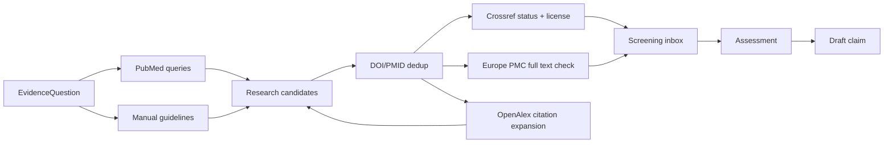

# Input sources — откуда Evidence Knowledge Base получает исследования

**Версия:** 1
**Дата:** 2026-08-02
**Scope:** исследования силовых тренировок у здоровых взрослых.

## 1. Что считается входом

На вход поступает не «знание» и не готовая рекомендация, а `ResearchCandidate` —
кандидат на разбор.

```text
EvidenceQuestion + SearchStrategy
            ↓
внешний ResearchCandidate
            ↓
dedup → screening → access check → extraction → assessment
            ↓
draft claim
```

Публикация может прийти из PubMed, ссылки в systematic review, citation graph или
ручного импорта. Канал обнаружения не определяет качество работы.

Минимальный входной пакет:

```js
{
  questionId: 'EQ-HYP-002',
  discoveredBy: 'pubmed_query',
  discoveryRef: 'failure_rir_v1',
  provider: 'pubmed',
  providerId: '38970765',
  identifiers: {
    doi: '10.1007/s40279-024-02069-2',
    pmid: '38970765',
    pmcid: null,
    openAlexId: null,
    trialRegistryId: null,
  },
  bibliographic: {
    title: '...',
    authors: ['...'],
    journal: 'Sports Medicine',
    publishedAt: '2024-07-06',
    publicationTypes: ['Meta-Analysis'],
    language: 'en',
  },
  abstract: '...',
  access: {
    landingPage: '...',
    fullTextUrl: null,
    openAccess: false,
    license: null,
    storagePermission: 'unknown',
  },
  publicationStatus: {
    retracted: false,
    corrected: false,
    expressionOfConcern: false,
    checkedAt: '2026-08-02',
  },
  rawMetadata: {},
  fetchedAt: '2026-08-02',
}
```

`abstract` может быть `null`: отсутствие abstract не означает автоматическое
исключение. `retracted: false` означает только отсутствие найденного сигнала на дату
проверки, а не вечную гарантию.

## 2. Источники по ролям

Мы не выбираем один «лучший сайт». Источники дополняют друг друга.

| Источник | Что берём | Чего от него не ждём | MVP |
|---|---|---|---:|
| PubMed/MEDLINE | Основной тематический поиск, PMID, MeSH, publication type, abstract, связанные corrections/retractions | Полные тексты всех издателей, citation graph всей науки | Да |
| Europe PMC | Biomedical metadata, PMCID, OA full text/XML там, где это разрешено | Право массово скачивать любой доступный текст | Да |
| Crossref/Crossmark | DOI normalization, bibliография, license links, версии, corrections/retractions/updates | Оценка качества исследования; сам full text Crossref не хранит | Да |
| OpenAlex | Citation graph, references/citations, related works, authors, topics | Канонический медицинский статус и гарантированную полноту abstract | Фаза 2/5 |
| ClinicalTrials.gov | Зарегистрированные, текущие и завершённые trials; поиск unpublished horizon | Доказательство эффективности до публикации результатов | Фаза 5 |
| Сайты проф. организаций | Guidelines, position stands, consensus statements | Полный автоматический discovery первичных studies | Ручной импорт |
| Ручной импорт DOI/PMID | Работа от reviewer, эксперта, статьи или пользователя | Автоматическое доверие источнику | Да |

## 3. Основной источник discovery: PubMed

PubMed — первая точка поиска для каждого `EvidenceQuestion`, потому что он даёт
стабильные identifiers, типы публикаций, MeSH и воспроизводимые запросы.

Для вопроса хранятся минимум три стратегии.

### 3.1 Broad discovery

Нужен высокий recall: systematic reviews, первичные trials и новые формулировки темы.

Пример для proximity to failure:

```text
("Resistance Training"[Mesh] OR resistance train*[Title/Abstract])
AND (
  failure[Title/Abstract]
  OR repetitions in reserve[Title/Abstract]
  OR proximity to failure[Title/Abstract]
  OR velocity loss[Title/Abstract]
)
AND (hypertroph*[Title/Abstract] OR strength[Title/Abstract])
NOT (rehabilitation[Title/Abstract])
```

### 3.2 Review-first query

Используется для построения первичного корпуса и поиска более нового synthesis:

```text
(<topic query>)
AND (
  systematic review[Publication Type]
  OR meta-analysis[Publication Type]
  OR guideline[Publication Type]
)
```

### 3.3 Primary-study update

После появления базового claim новые RCT ищутся отдельно:

```text
(<topic query>)
AND (
  randomized controlled trial[Publication Type]
  OR controlled clinical trial[Publication Type]
)
AND (2024:3000[dp])
```

Дата не зашивается навсегда: ingestion использует `lastSuccessfulRunAt` и overlap
window, чтобы не потерять записи с задержкой индексации.

### 3.4 Как получаем обновления

Для редакционного прототипа достаточно PubMed RSS/saved searches. В технической
версии те же запросы выполняются через NCBI E-utilities.

PubMed поддерживает RSS и email alerts для сохранённых запросов; E-utilities дают
машинный доступ. Запросы должны иметь идентификацию приложения/email, caching и
rate limiting.

## 4. Откуда берётся первоначальный корпус

Пустой вопрос не стоит начинать с сотен отдельных RCT. Bootstrap идёт сверху вниз.

### Шаг 1 — актуальный guideline/position stand

Ручной импорт с официального сайта организации и проверка DOI/PMID:

- ACSM position stands;
- NSCA position statements, если они соответствуют вопросу;
- IOC consensus statements для спортивно-медицинских тем;
- WHO/AHA — только для вопросов общего здоровья, которые они реально покрывают;
- другие профильные документы после проверки методологии и conflicts.

Организационный логотип не равен high certainty. Проверяем search strategy,
eligibility, метод оценки evidence, дату cutoff и управление conflicts.

### Шаг 2 — свежие systematic reviews/meta-analyses

Берём 1–3 наиболее релевантных synthesis, а не автоматически самый новый. Они дают:

- карту терминов;
- список включённых первичных исследований;
- возможные subgroup/moderator analyses;
- пробелы и противоречия;
- более старые ключевые reviews.

### Шаг 3 — backward citation chasing

Из включённых studies и references извлекаются работы, критичные для вывода. Полный
список каждого review не импортируется без разбора: одна RCT часто повторяется в
нескольких meta-analyses.

### Шаг 4 — forward citation chasing

OpenAlex/Crossref помогают найти:

- более новые работы, цитирующие ключевой review/RCT;
- correction или retraction notice;
- updated review;
- related works, не пойманные исходной терминологией.

Citation count используется только для навигации, не как quality score.

### Шаг 5 — последние первичные исследования

Отдельный PubMed query закрывает период после search cutoff последнего хорошего
systematic review. Это важно: review 2026 года может включать поиск только до 2024-го.

## 5. Europe PMC: доступ к тексту

Europe PMC выполняет две роли:

1. дополняет PubMed metadata и identifiers;
2. предоставляет OA full text/XML для разрешённого subset.

Важно различать:

```text
можно открыть бесплатно ≠ можно хранить ≠ можно перерабатывать коммерчески
```

Для каждой версии фиксируем license и права. Автоматически скачиваем только OA
subset при совместимых условиях. Europe PMC прямо ограничивает bulk download
контентом, для которого такой доступ разрешён.

Если полный текст закрыт:

- сохраняем DOI/PMID, metadata, source URL и допустимый abstract;
- не скачиваем PDF обходным способом;
- reviewer читает через законный доступ;
- внутренний assessment хранит собственный краткий пересказ и locators, а не копию
  статьи;
- до full-text review assessment остаётся `abstract_only` и не может стать approved.

## 6. Crossref/Crossmark: нормализация и статус

После discovery по DOI запрашиваем Crossref:

- нормализованный DOI;
- title/authors/journal/date;
- publisher-deposited license и full-text links;
- relations preprint/version-of-record;
- funding/ORCID/ROR, если доступны;
- post-publication updates.

Для каждой используемой работы регулярно проверяем:

- `has-update` / `is-update`;
- correction, erratum, expression of concern;
- partial/full retraction;
- withdrawal/new version.

Crossref metadata дополняется trusted sources, включая Retraction Watch, но покрытие
издательских обновлений не идеально. Поэтому сигнал сверяется с PubMed и landing page
издателя перед финальным решением.

## 7. OpenAlex: расширение графа

OpenAlex не является первой точкой медицинской проверки. Он нужен после появления
seed works:

- references и works that cite this work;
- похожие работы;
- author/topic discovery;
- поиск исследований вне PubMed;
- оценка того, появился ли новый research cluster.

Работа из OpenAlex всё равно проходит DOI/PMID normalization, status check и обычный
screening. `cited_by_count` не влияет на certainty.

## 8. ClinicalTrials.gov: горизонт, а не evidence

Для вопросов, где проводятся интервенционные trials, registry помогает видеть:

- что сейчас исследуется;
- завершённые trials без найденной публикации;
- preregistered outcomes и planned sample;
- возможный publication lag/bias.

Статус `completed` не означает положительный или даже опубликованный результат.
Registry record может создать watch task, но не supporting relation для claim до
доступных результатов и assessment.

## 9. Ручные каналы

Автоматический поиск дополняется, но не заменяется следующими каналами:

- bibliographies хороших reviews/guidelines;
- предложения scientific reviewer;
- alerts ключевых авторов/research groups;
- table of contents профильных журналов;
- DOI/PMID, присланный пользователем или найденный в обсуждении;
- references из качественной статьи блога — только как leads.

Примеры журналов watchlist: `Sports Medicine`, `British Journal of Sports Medicine`,
`Medicine & Science in Sports & Exercise`, `Journal of Strength and Conditioning
Research`, `Journal of Sports Sciences`, `European Journal of Sport Science`.

Это не whitelist качества. Хорошая работа вне списка принимается, плохая внутри —
отклоняется.

## 10. Какие типы материалов допускаются

| Тип | Роль | Может напрямую поддерживать approved claim |
|---|---|---:|
| Methodologically sound guideline/position stand | Верхнеуровневый synthesis | Да, с appraisal |
| Systematic review/meta-analysis | Основной synthesis | Да, с appraisal |
| RCT/controlled longitudinal study | Прямое primary evidence | Да |
| Observational longitudinal study | Контекст/ассоциация | Иногда, с ограничением causal wording |
| Acute/mechanistic study | Объяснение механизма | Не как единственное основание longitudinal результата |
| Narrative review/expert opinion | Термины, гипотезы, поиск references | Обычно нет |
| Preprint | Early warning | Нет до peer review, кроме отдельного disputed context |
| Trial registry/protocol | Horizon и publication-bias context | Нет |
| Blog/video/social post | Lead на первичный источник | Нет |

## 11. Source funnel



## 12. Периодичность

| Процесс | Частота MVP | Почему |
|---|---:|---|
| PubMed discovery по P0-вопросам | еженедельно | Новые записи без лишнего шума |
| P1-вопросы | раз в 2–4 недели | Ниже продуктовый impact |
| Status check используемых DOI/PMID | ежедневно маленькими batch | Быстро убрать retraction/concern |
| Citation expansion ключевых works | ежемесячно | Ловит новую терминологию и related clusters |
| Trial horizon | ежемесячно/ежеквартально | Не влияет на runtime немедленно |
| Полный пересмотр P0 claim | каждые 6 месяцев | Даже если alerts ничего не нашли |
| Полный пересмотр P1 claim | 12–18 месяцев | По freshness policy вопроса |

Высокоимпактный сигнал — retraction, новый major guideline или крупный contradictory
review — создаёт внеплановый review task.

## 13. Что произошло в Spikes 01–02

Первый корпус был собран review-first способом:

1. актуальный ACSM Position Stand 2026;
2. профильные meta-analyses по volume/frequency, RIR/failure, load и rest;
3. одно прямое RIR-vs-failure RCT для проверки практического claim;
4. PubMed identifiers и доступные PMC/full-text records;
5. точечная Crossmark-проверка; полная status/license проверка оставлена gate перед
   scientific approval.

Spike 02 тем же funnel добавил progression, ROM, exercise order, periodization,
deload и concurrent training. В нём особенно проявились три требования к intake:

- одна тема требует нескольких outcome-specific claims;
- umbrella review нужно связывать с входящими reviews и контролировать overlap;
- похожие термины нельзя схлопывать: periodization ≠ deload, а partial ROM нужно
  разделять по участку амплитуды и длине мышцы.

Это было намеренно ручное построение корпуса: цель двух spikes — проверить editorial
model, а не автоматизацию ingestion.

## 14. Реализация по этапам

### Редакционный MVP

- PubMed saved searches/RSS;
- ручной DOI/PMID import;
- Europe PMC/PMC full-text check;
- ручной Crossmark status check;
- Markdown-карточки.

### Data foundation

- PubMed E-utilities adapter;
- Europe PMC adapter;
- Crossref adapter;
- provider records + dedup;
- ingestion runs/checkpoints;
- admin inbox.

### Расширение

- OpenAlex citation graph;
- ClinicalTrials.gov horizon;
- author/journal alerts;
- automated impact review для updates/retractions.

## 15. Официальная документация источников

- [PubMed User Guide: search, RSS и alerts](https://pubmed.ncbi.nlm.nih.gov/help/)
- [NCBI E-utilities](https://www.ncbi.nlm.nih.gov/books/NBK25497/)
- [Europe PMC developer resources](https://europepmc.org/developers)
- [OpenAlex API](https://developers.openalex.org/api-reference/introduction)
- [Crossref REST API](https://support.crossref.org/hc/en-us/articles/214320426-REST-API)
- [Crossref filters и post-publication updates](https://www.crossref.org/documentation/retrieve-metadata/rest-api/rest-api-filters/)
- [Crossmark](https://crossref.org/services/crossmark)
- [ClinicalTrials.gov API](https://clinicaltrials.gov/data-about-studies/learn-about-api)
